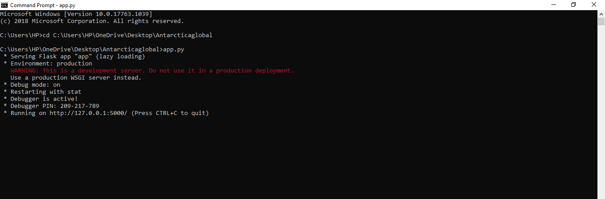
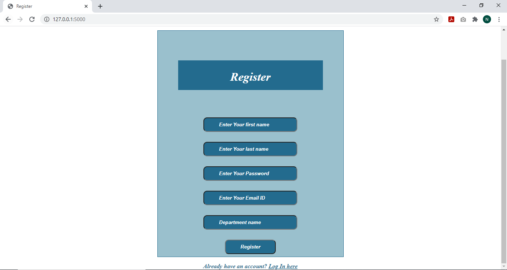
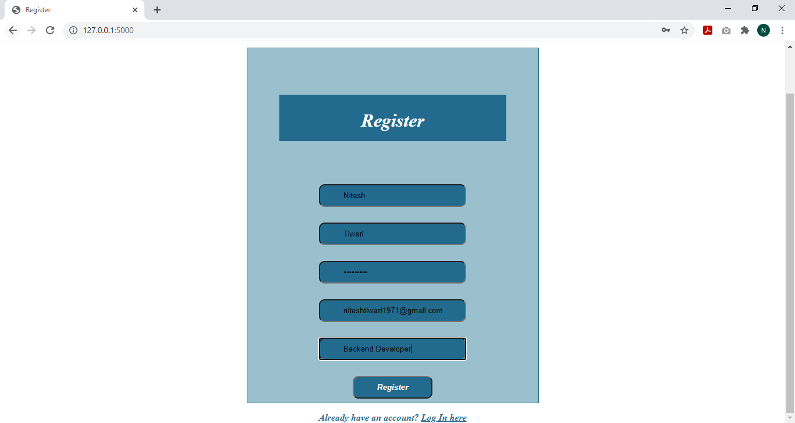
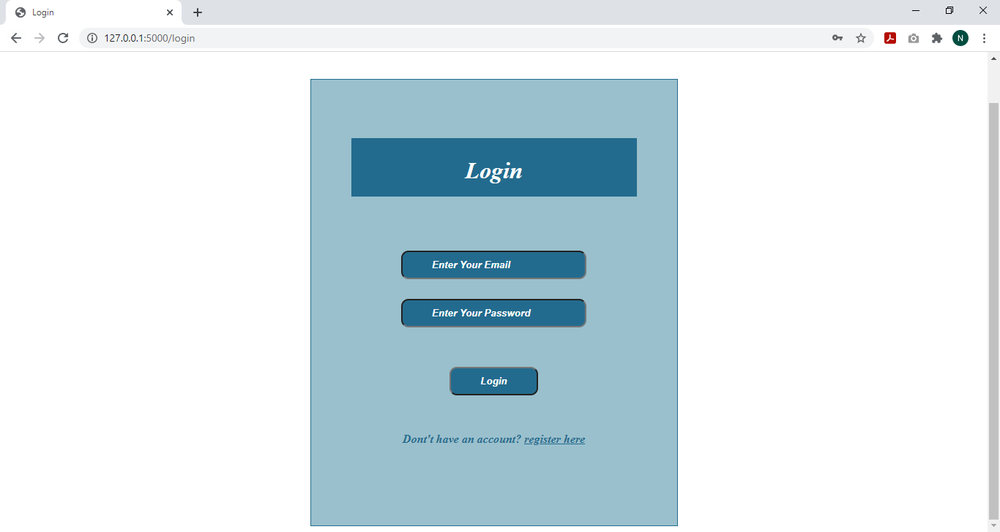
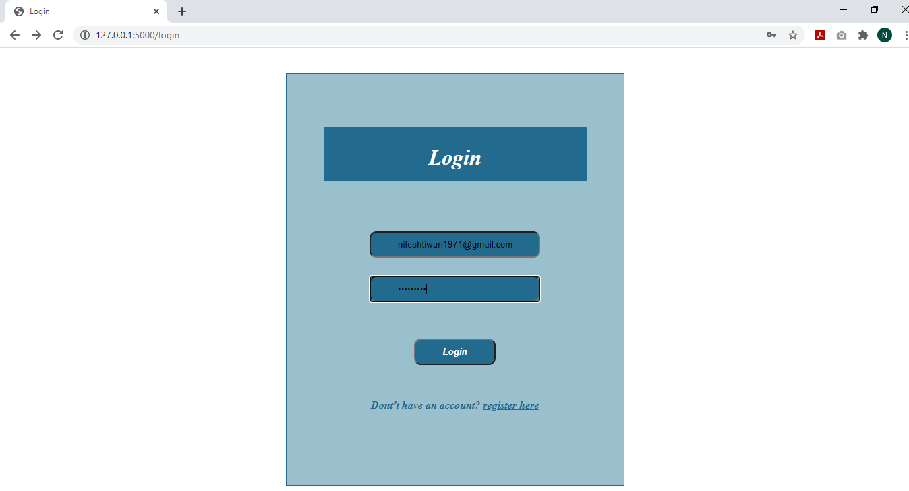
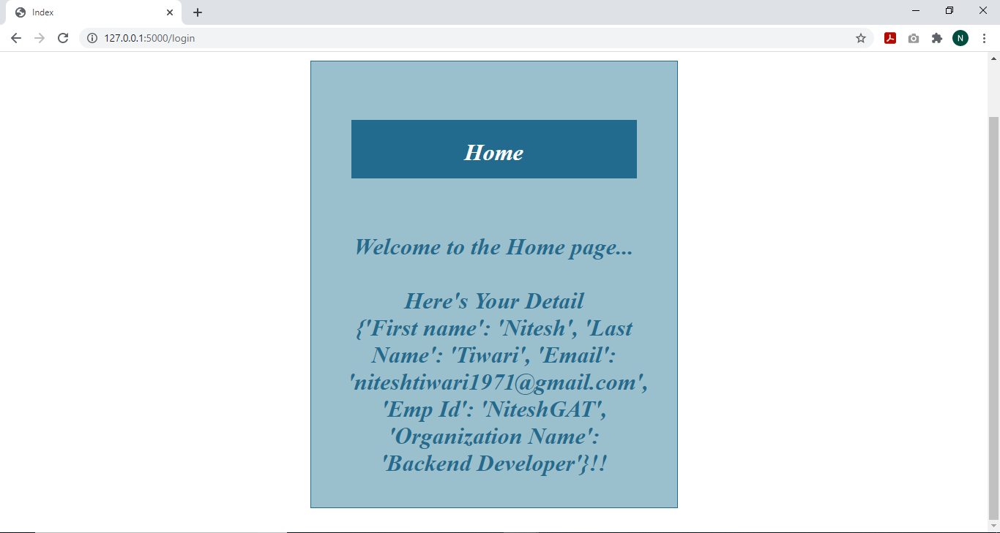
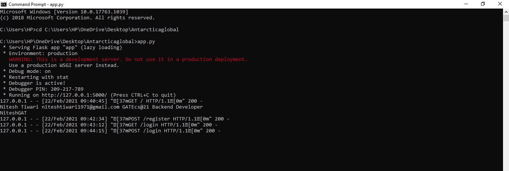

# Antarctica-global-backend   
It is a RESTful (Representational State Transfer) API (Application Programming Interface) 	 for Registration, Login and  get UserList  
## To run the project follow these simple steps:  
### Step 1: Clone or Download the zip file from the repository
### Step 2: Open Command prompt and set the path of folder 
### Step 3: Run the command        ####pip install -r requirements.txt
### Step 4: After that run command  ####app.py 
### Step 5: After running above step4 it will run on your localhost with given address then copy the address and run on web browser  for eg; ####Running on http://127.0.0.1:5000/ (Press CTRL+C to quit) 
### Step 6: It will show Register form then enter the required data to login and if you already registered then just login
### Step 7: After  Login it will display the sorted data as First Name,Last Name, EmailID,employeeID and OrganizationName
 
 
### Setting path and running ####app.py

### Register Form with empty data

### Register Form with entered data

### Login Form with empty data 

### Login Form with entered data 

### Display the sorted data as First Name,Last Name, EmailID,employeeID and OrganizationName

### After running all the requirements closing the local host and exiting 

 

